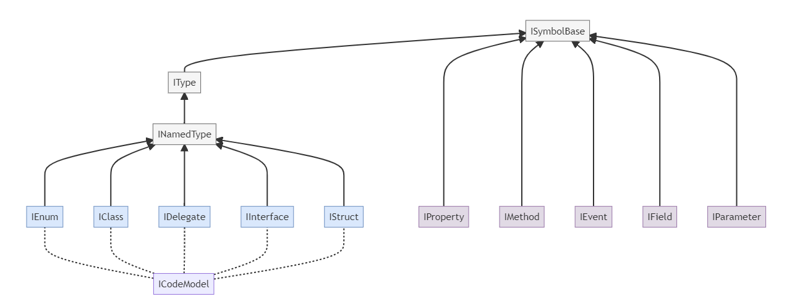

> This file was auto generated from template : [CodeModel.nt](https://github.com/NeVeSpl/NTypewriter/blob/master/DocumentationGenerator/CodeModel.nt)

> Above diagram was generated from : [NTypewriter.CodeModel.flowchart.mmd](https://github.com/NeVeSpl/NTypewriter/blob/master/Documentation/NTypewriter.CodeModel.flowchart.mmd)

      
#### IAttribute

Represents a declared attribute on a symbol.

Property | Description | Returns
--------|---------|-----------
Arguments | The arguments of the attribute. | [`IEnumerable<IAttributeArgument>`](#IAttributeArgument)  
AttributeClass | The attribute class. | [`IClass`](#IClass)  
FullName | The full original name of the attribute including namespace and containing class names. | `string`  
Name | The name of the attribute without Attribute postfix. | `string`  

Implements : 

---

      
#### IAttributeArgument

Represents attribute argument.

Property | Description | Returns
--------|---------|-----------
IsFromConstructor | Determines if arguments is present in the attribute constructor | `bool`  
Name | The name of the argument. | `string`  
Type | The type of the argument. | [`IType`](#IType)  
Value | The value of the argument | `object`  

Implements : 

---

      
#### IClass

Represents a class.

Property | Description | Returns
--------|---------|-----------
BaseClass | The declared base class of this class, or null. Returns null if the class inherits from System.Object. | [`IClass`](#IClass)  
Constructors | All instance constructors defined in the class. | [`IEnumerable<IMethod>`](#IMethod)  
Events | All events defined in the class. | [`IEnumerable<IEvent>`](#IEvent)  
Fields | All fields defined in the class. | [`IEnumerable<IField>`](#IField)  
HasBaseClass | Determines if the class has base class other than System.Object. | `bool`  
IsSealed | Determines if the class is sealed | `bool`  
Methods | All methods defined in the class. | [`IEnumerable<IMethod>`](#IMethod)  
NestedClasses | All nested classes defined in the class. | [`IEnumerable<IClass>`](#IClass)  
NestedDelegates | All nested delegates defined in the class. | [`IEnumerable<IDelegate>`](#IDelegate)  
NestedEnums | All nested enums defined in the class. | [`IEnumerable<IEnum>`](#IEnum)  
NestedInterfaces | All nested interfaces defined in the class. | [`IEnumerable<IInterface>`](#IInterface)  
Properties | All properties defined in the class. | [`IEnumerable<IProperty>`](#IProperty)  

Implements :  [`INamedType`](#INamedType) 

---

      
#### ICodeModel

Representation of the code.
    ICodeModel is the entry point of accessing information about the code.

Property | Description | Returns
--------|---------|-----------
Classes | All classes defined in the code | [`IEnumerable<IClass>`](#IClass)  
Delegates | All delegates defined in the code | [`IEnumerable<IDelegate>`](#IDelegate)  
Enums | All enums defined in the code | [`IEnumerable<IEnum>`](#IEnum)  
Interfaces | All interfaces defined in the code | [`IEnumerable<IInterface>`](#IInterface)  
Structs | All structs defined in the code | [`IEnumerable<IStruct>`](#IStruct)  

Implements : 

---

      
#### IDelegate

Represents a delegate.

Property | Description | Returns
--------|---------|-----------
Parameters | The parameters of this delegate. If this delegate has no parameters, returns an empty collection. | [`IEnumerable<IParameter>`](#IParameter)  
ReturnType | The return type of the delegate. | [`IType`](#IType)  

Implements :  [`INamedType`](#INamedType) 

---

      
#### IDocumentationCommentXml

Represents a documentation XML comment.

Property | Description | Returns
--------|---------|-----------
Params | Collection of the param tag. | [`IEnumerable<IDocumentationCommentXmlParam>`](#IDocumentationCommentXmlParam)  
Returns | The content of the return tag. | `string`  
Summary | The content of the summary tag. | `string`  

Implements : 

---

      
#### IDocumentationCommentXmlParam

Represents a documentation XML param tag.

Property | Description | Returns
--------|---------|-----------
Name | The value of the name attribute | `string`  
Value | The content of the param tag | `string`  

Implements : 

---

      
#### IEnum

Represents an enum.

Property | Description | Returns
--------|---------|-----------
UnderlyingType | Gets the underlying type | [`IType`](#IType)  
Values | All values defined in the enum. | [`IEnumerable<IEnumValue>`](#IEnumValue)  

Implements :  [`INamedType`](#INamedType) 

---

      
#### IEnumValue

Represents a named constant which is a member of an enum.

Property | Description | Returns
--------|---------|-----------
Attributes | All attributes declared on the enum value. | [`IEnumerable<IAttribute>`](#IAttribute)  
Name | The name of the enum member | `string`  
Value | The value of the enum member | `object`  

Implements : 

---

      
#### IEvent

Represents an event.

Property | Description | Returns
--------|---------|-----------
IsSealed | Determines if the event is sealed | `bool`  
Type | The type of the event. | [`IType`](#IType)  

Implements :  [`ISymbolBase`](#ISymbolBase) 

---

      
#### IField

Represents a field.

Property | Description | Returns
--------|---------|-----------
ConstantValue | Constant value assigned to this field | `object`  
HasConstantValue | Returns false if the field wasn't declared as "const", or constant value was omitted or erroneous. True otherwise. | `bool`  
IsConst | Determines if the field was declared as "const". | `bool`  
IsReadOnly | Determines if the field was declared as "readonly". | `bool`  
Type | The type of the field. | [`IType`](#IType)  

Implements :  [`ISymbolBase`](#ISymbolBase) 

---

      
#### IInterface

Represents a interface.

Property | Description | Returns
--------|---------|-----------
Events | All events defined in the interface. | [`IEnumerable<IEvent>`](#IEvent)  
Methods | All methods defined in the interface. | [`IEnumerable<IMethod>`](#IMethod)  
Properties | All properties defined in the interface. | [`IEnumerable<IProperty>`](#IProperty)  

Implements :  [`INamedType`](#INamedType) 

---

      
#### ILocation

A program location in source code.

Property | Description | Returns
--------|---------|-----------
EndLinePosition | Gets the last line number | `int`  
IsInSource | Returns true if the location represents a specific location in a source code file. | `bool`  
Path | Path, or null if the span represents an invalid value. | `string`  
StartLinePosition | Gets the first line number | `int`  

Implements : 

---

      
#### IMethod

Represents a method.

Property | Description | Returns
--------|---------|-----------
IsAsync | Determines if the method is an async method | `bool`  
IsGeneric | Determines if the method is generic (it has any type parameters) | `bool`  
IsOverride | Determines if the method is override | `bool`  
IsSealed | Determines if the method is sealed | `bool`  
Parameters | All parameters of the method. | [`IEnumerable<IParameter>`](#IParameter)  
ReturnType | The return type of the method. | [`IType`](#IType)  
TypeParameters | The type parameters of the method. If the method is not generic, returns an empty collection. | [`IEnumerable<ITypeParameter>`](#ITypeParameter)  

Implements :  [`ISymbolBase`](#ISymbolBase) 

---

      
#### INamedType

Represents a type other than an array, a pointer, a type parameter.

Property | Description | Returns
--------|---------|-----------
IsNested | Determines if the type is declared inside other type | `bool`  
TypeParameters | The type parameters of the type. If the type is not generic, returns an empty collection. | [`IEnumerable<ITypeParameter>`](#ITypeParameter)  

Implements :  [`IType`](#IType) 

---

      
#### IParameter

Represents a method parameter.

Property | Description | Returns
--------|---------|-----------
DefaultValue | The default value of the parameter | `object`  
HasDefaultValue | Determines if the parameter has a default value to be passed when no value is provided as an argument to a call. | `bool`  
Type | The type of the parameter | [`IType`](#IType)  

Implements :  [`ISymbolBase`](#ISymbolBase) 

---

      
#### IProperty

Represents a property.

Property | Description | Returns
--------|---------|-----------
IsIndexer | Determines if the property is really an indexer. | `bool`  
IsReadOnly | Determines if the property is a read-only property | `bool`  
IsSealed | Determines if the property is sealed | `bool`  
IsWriteOnly | Determines if the property is a write-only property | `bool`  
Type | The type of the property. | [`IType`](#IType)  

Implements :  [`ISymbolBase`](#ISymbolBase) 

---

      
#### IStruct

Represents a struct.

Property | Description | Returns
--------|---------|-----------
Constructors | All instance constructors defined in the struct. | [`IEnumerable<IMethod>`](#IMethod)  
Events | All events defined in the struct. | [`IEnumerable<IEvent>`](#IEvent)  
Fields | All fields defined in the struct. | [`IEnumerable<IField>`](#IField)  
Methods | All methods defined in the struct. | [`IEnumerable<IMethod>`](#IMethod)  
NestedClasses | All nested classes defined in the struct. | [`IEnumerable<IClass>`](#IClass)  
NestedDelegates | All nested delegates defined in the struct. | [`IEnumerable<IDelegate>`](#IDelegate)  
NestedEnums | All nested enums defined in the struct. | [`IEnumerable<IEnum>`](#IEnum)  
NestedInterfaces | All nested interfaces defined in the struct. | [`IEnumerable<IInterface>`](#IInterface)  
Properties | All properties defined in the struct. | [`IEnumerable<IProperty>`](#IProperty)  

Implements :  [`INamedType`](#INamedType) 

---

      
#### ISymbolBase

Represents a symbol (namespace, class, method, parameter, etc.)

Property | Description | Returns
--------|---------|-----------
Attributes | All attributes declared on the symbol. | [`IEnumerable<IAttribute>`](#IAttribute)  
BareName | The prefix of the Name that consists only letters and digits. | `string`  
ContainingType | The type that contains this symbol. | [`INamedType`](#INamedType)  
DocComment | The XML documentation for the comment associated with the symbol. | [`IDocumentationCommentXml`](#IDocumentationCommentXml)  
FullName | The Namespace + the name of the symbol | `string`  
IsAbstract | Determines if the symbol is abstract | `bool`  
IsArray | Determines if the symbol is an array | `bool`  
IsErrorType | Determines if the symbol represents an error in syntax; | `bool`  
IsEvent | Determines if the symbol is an event | `bool`  
IsField | Determines if the symbol is a field | `bool`  
IsMethod | Determines if the symbol is a method | `bool`  
IsProperty | Determines if the symbol is a property | `bool`  
IsPublic | Determines if the symbol is public | `bool`  
IsStatic | Determines if the symbol is static | `bool`  
IsTypeParameter | Determines if the symbol is a type parameter | `bool`  
IsVirtual | Determines if the symbol is virtual | `bool`  
Locations | Gets the locations where the symbol was originally defined, either in source or metadata. Some symbols (for example, partial classes) may be defined in more than one location. | [`IEnumerable<ILocation>`](#ILocation)  
Name | The name of the symbol | `string`  
Namespace | The nearest enclosing namespace for the symbol. | `string`  

Implements : 

---

      
#### IType

Represents a type.

Property | Description | Returns
--------|---------|-----------
AllInterfaces | The list of all interfaces of which this type is a declared subtype, excluding this type itself. | [`IEnumerable<IInterface>`](#IInterface)  
ArrayType | The type of the elements stored in the array. | [`IType`](#IType)  
BaseType | The declared base type of this type, or null. Returns null if the class inherits from System.Object or if the type is a value type. | [`IType`](#IType)  
Interfaces | The set of interfaces that this type directly implements. This set does not include interfaces that are base interfaces of directly implemented interfaces. | [`IEnumerable<IInterface>`](#IInterface)  
IsAnonymousType | Determines if the type is anonymous | `bool`  
IsCollection | Determines if the type is a collection | `bool`  
IsDelegate | Determines if the type is a delegate | `bool`  
IsDynamic | Determines if the type is a dynamic | `bool`  
IsEnum | Determines if the type is an enum | `bool`  
IsEnumerable | Determines if the type is enumerable | `bool`  
IsGeneric | Determines if the type is generic | `bool`  
IsInterface | Determines if the type is an interface | `bool`  
IsNullable | Determines if the type is nullable | `bool`  
IsPrimitive | Determines if the type is primitive | `bool`  
IsRecord | Determines if the type is a record | `bool`  
IsReferenceType | Determines if the type is a reference type | `bool`  
IsTuple | Determines if the type is a tuple | `bool`  
IsValueType | Determines if the type is a value type | `bool`  
TypeArguments | The type arguments that have been substituted for the type parameters | [`IEnumerable<IType>`](#IType)  

Implements :  [`ISymbolBase`](#ISymbolBase) 

---

      
#### ITypedConstant

Represents a typed constant.

Property | Description | Returns
--------|---------|-----------
Type | The type of the constant. | [`IType`](#IType)  
Value | The value for a non-array constant. | `object`  

Implements : 

---

      
#### ITypeParameter

Represents a generic type parameter

Property | Description | Returns
--------|---------|-----------

Implements : 

---

      
#### ITypeReferencedByMember

Property | Description | Returns
--------|---------|-----------
Parent |  | [`ISymbolBase`](#ISymbolBase)  

Implements :  [`IType`](#IType) 

---
