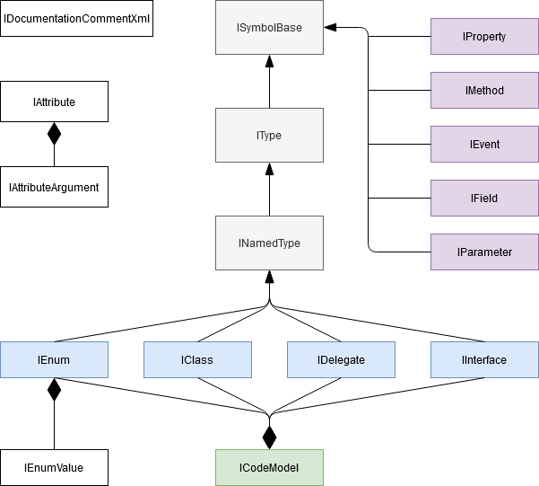

> This file was auto generated from template : [CodeModel.nt](https://github.com/NeVeSpl/NTypewriter/blob/master/DocumentationGenerator/CodeModel.nt)

      
#### IField

Represents a field.

Property | Description | Returns
--------|---------|-----------
ConstantValue | Constant value assigned to this field | `object`  
HasConstantValue | Returns false if the field wasn't declared as "const", or constant value was omitted or erroneous. True otherwise. | `bool`  
IsConst | Determines if the field was declared as "const". | `bool`  
IsReadOnly | Determines if the field was declared as "readonly". | `bool`  
Type | The type of the field. | `IType`  

---

      
#### IAttribute

Represents a declared attribute on a symbol.

Property | Description | Returns
--------|---------|-----------
AttributeClass | The attribute class. | `IClass`  
FullName | The full original name of the attribute including namespace and containing class names. | `string`  
Name | The name of the attribute without Attribute postfix. | `string`  
Arguments | The arguments of the attribute. | `IEnumerable<IAttributeArgument>`  

---

      
#### IEnumValue

Represents a named constant which is a member of an enum.

Property | Description | Returns
--------|---------|-----------
Name | The name of the enum member | `string`  
Value | The value of the enum member | `object`  
Attributes | All attributes declared on the enum value. | `IEnumerable<IAttribute>`  

---

      
#### ITypeParameter

Represents a generic type parameter

Property | Description | Returns
--------|---------|-----------

---

      
#### INamedType

Represents a type other than an array, a pointer, a type parameter.

Property | Description | Returns
--------|---------|-----------
IsNested | Determines if the type is declared inside other type | `bool`  
TypeParameters | The type parameters of the type. If the type is not generic, returns an empty collection. | `IEnumerable<ITypeParameter>`  

---

      
#### IType

Represents a type.

Property | Description | Returns
--------|---------|-----------
BaseType | The declared base type of this type, or null. Returns null if the class inherits from System.Object or if the type is a value type. | `IType`  
IsAnonymousType | Determines if the type is anonymous | `bool`  
IsCollection | Determines if the type is a collection | `bool`  
IsDelegate | Determines if the type is a delegate | `bool`  
IsInterface | Determines if the type is an interface | `bool`  
IsEnum | Determines if the type is an enum | `bool`  
IsEnumerable | Determines if the type is enumerable | `bool`  
IsGeneric | Determines if the type is generic | `bool`  
IsNullable | Determines if the type is nullable | `bool`  
IsPrimitive | Determines if the type is primitive | `bool`  
IsReferenceType | Determines if the type is a reference type | `bool`  
IsValueType | Determines if the type is a value type | `bool`  
ArrayType | The type of the elements stored in the array. | `IType`  
Interfaces | The set of interfaces that this type directly implements. This set does not include interfaces that are base interfaces of directly implemented interfaces. | `IEnumerable<IInterface>`  
AllInterfaces | The list of all interfaces of which this type is a declared subtype, excluding this type itself. | `IEnumerable<IInterface>`  
TypeArguments | The type arguments that have been substituted for the type parameters | `IEnumerable<IType>`  

---

      
#### IProperty

Represents a property.

Property | Description | Returns
--------|---------|-----------
IsIndexer | Determines if the property is really an indexer. | `bool`  
IsWriteOnly | Determines if the property is a write-only property | `bool`  
IsReadOnly | Determines if the property is a read-only property | `bool`  
Type | The type of the property. | `IType`  

---

      
#### IAttributeArgument

Represents attribute argument.

Property | Description | Returns
--------|---------|-----------
IsFromConstructor | Determines if arguments is present in the attribute constructor | `bool`  
Name | The name of the argument. | `string`  
Type | The type of the argument. | `IType`  
Value | The value of the argument. | `object`  

---

      
#### ISymbolBase

Represents a symbol (namespace, class, method, parameter, etc.)

Property | Description | Returns
--------|---------|-----------
Attributes | All attributes declared on the symbol. | `IEnumerable<IAttribute>`  
DocComment | The XML documentation for the comment associated with the symbol. | `IDocumentationCommentXml`  
IsAbstract | Determines if the symbol is abstract | `bool`  
IsVirtual | Determines if the symbol is virtual | `bool`  
IsArray | Determines if the symbol is an array | `bool`  
IsEvent | Determines if the symbol is an event | `bool`  
IsField | Determines if the symbol is a field | `bool`  
IsMethod | Determines if the symbol is a method | `bool`  
IsProperty | Determines if the symbol is a property | `bool`  
IsPublic | Determines if the symbol is public | `bool`  
IsStatic | Determines if the symbol is static | `bool`  
IsTypeParameter | Determines if the symbol is a type parameter | `bool`  
ContainingType | The type that contains this symbol. | `INamedType`  
FullName | The Namespace + the name of the symbol | `string`  
Name | The name of the symbol | `string`  
BareName | The prefix of the Name that consists only letters and digits. | `string`  
Namespace | The nearest enclosing namespace for the symbol. | `string`  
Locations | Gets the locations where the symbol was originally defined, either in source or metadata. Some symbols (for example, partial classes) may be defined in more than one location. | `IEnumerable<ILocation>`  

---

      
#### IEnum

Represents an enum.

Property | Description | Returns
--------|---------|-----------
Values | All values defined in the enum. | `IEnumerable<IEnumValue>`  

---

      
#### IInterface

Represents a interface.

Property | Description | Returns
--------|---------|-----------
Events | All events defined in the interface. | `IEnumerable<IEvent>`  
Methods | All methods defined in the interface. | `IEnumerable<IMethod>`  
Properties | All properties defined in the interface. | `IEnumerable<IProperty>`  

---

      
#### IEvent

Represents an event.

Property | Description | Returns
--------|---------|-----------
Type | The type of the event. | `IType`  

---

      
#### ICodeModel

Representation of the code.
    ICodeModel is the entry point of accessing information about the code.

Property | Description | Returns
--------|---------|-----------
Classes | All classes defined in the code | `IEnumerable<IClass>`  
Delegates | All delegates defined in the code | `IEnumerable<IDelegate>`  
Enums | All enums defined in the code | `IEnumerable<IEnum>`  
Interfaces | All interfaces defined in the code | `IEnumerable<IInterface>`  

---

      
#### IClass

Represents a class.

Property | Description | Returns
--------|---------|-----------
BaseClass | The declared base class of this class, or null. Returns null if the class inherits from System.Object. | `IClass`  
Constructors | All instance constructors defined in the class. | `IEnumerable<IMethod>`  
Events | All events defined in the class. | `IEnumerable<IEvent>`  
Fields | All fields defined in the class. | `IEnumerable<IField>`  
HasBaseClass | Determines if the class has base class other than System.Object. | `bool`  
Methods | All methods defined in the class. | `IEnumerable<IMethod>`  
NestedClasses | All nested classes defined in the class. | `IEnumerable<IClass>`  
NestedDelegates | All nested delegates defined in the class. | `IEnumerable<IDelegate>`  
NestedEnums | All nested enums defined in the class. | `IEnumerable<IEnum>`  
NestedInterfaces | All nested interfaces defined in the class. | `IEnumerable<IInterface>`  
Properties | All properties defined in the class. | `IEnumerable<IProperty>`  

---

      
#### IParameter

Represents a method parameter.

Property | Description | Returns
--------|---------|-----------
DefaultValue | The default value of the parameter | `object`  
HasDefaultValue | Determines if the parameter has a default value to be passed when no value is provided as an argument to a call. | `bool`  
Type | The type of the parameter | `IType`  

---

      
#### IMethod

Represents a method.

Property | Description | Returns
--------|---------|-----------
IsAsync | Determines if the method is an async method | `bool`  
IsGeneric | Determines if the method is generic (it has any type parameters) | `bool`  
Parameters | All parameters of the method. | `IEnumerable<IParameter>`  
ReturnType | The return type of the method. | `IType`  
TypeParameters | The type parameters of the method. If the method is not generic, returns an empty collection. | `IEnumerable<ITypeParameter>`  

---

      
#### ILocation

A program location in source code.

Property | Description | Returns
--------|---------|-----------
IsInSource | Returns true if the location represents a specific location in a source code file. | `bool`  
Path | Path, or null if the span represents an invalid value. | `string`  
StartLinePosition | Gets the first line number | `int`  
EndLinePosition | Gets the last line number | `int`  

---

      
#### IDelegate

Represents a delegate.

Property | Description | Returns
--------|---------|-----------
Parameters | The parameters of this delegate. If this delegate has no parameters, returns an empty collection. | `IEnumerable<IParameter>`  
ReturnType | The return type of the delegate. | `IType`  

---

      
#### ITypeReferencedByMember

Property | Description | Returns
--------|---------|-----------
Parent |  | `ISymbolBase`  

---

      
#### IDocumentationCommentXml

Represents a documentation XML comment.

Property | Description | Returns
--------|---------|-----------
Params | Collection of the param tag. | `IEnumerable<IDocumentationCommentXmlParam>`  
Returns | The content of the return tag. | `string`  
Summary | The content of the summary tag. | `string`  

---

      
#### IDocumentationCommentXmlParam

Represents a documentation XML param tag.

Property | Description | Returns
--------|---------|-----------
Name | The value of the name attribute | `string`  
Value | The content of the param tag | `string`  

---
