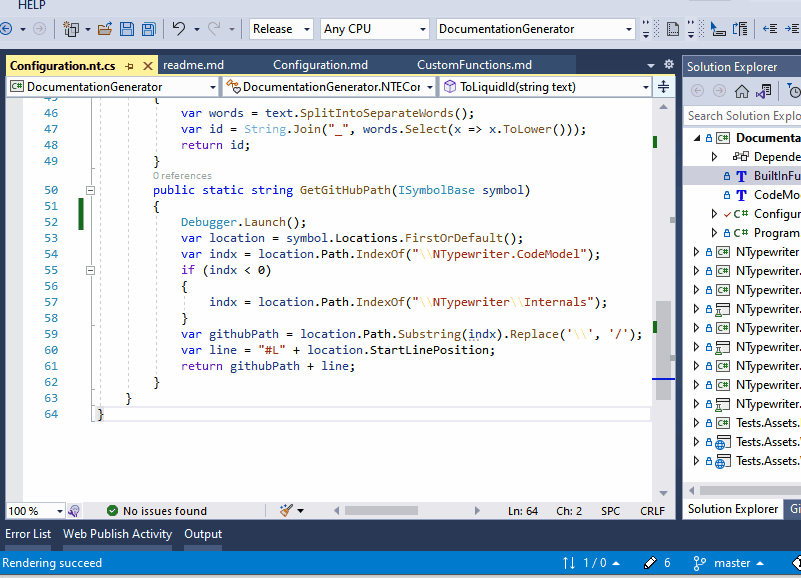

## Custom functions

### Nugets

This nuget gives access to code model abstractions:

https://www.nuget.org/packages/NTypewriter.CodeModel/

### Custom functions

You can extend your template with custom functions. Custom functions are defined in separate **.nt.cs** file that should be located in the same project as *.nt template file. It does not have to be csharp project though, since this file will be compiled outside of the project. This imposes  some constraints on the file:  

- no external dependencies are allowed 
- custom functions need to be defined as methods in a public static non-generic class.
- the file will be compiled with **.net Standard 2.0** regardless of the project settings in which it is placed

Sample file (*.nt.cs) with custom function and all necessary boilerplate code:

```csharp
using System;
using System.Collections.Generic;
using NTypewriter.CodeModel;

namespace ConsoleApp
{    
    public static class NameIsNotImportant 
    { 
        public static string MyCustomFunction(IClass @class)
        {
            return $"Hello world from {@class.Name}";
        }
    }
}
```

All defined custom functions are available in template with "Custom" prefix. Only public static methods defined inside class are recognized as custom functions.

```
{{- capture output
       for class in data.Classes 
           class | Custom.MyCustomFunction | String.Append "\n"
      end
   end
   Save output "index.txt"
   }}
```

#### How to debug

You can debug custom functions with the help of the second instance of Visual Studio. The easiest way to do that is by placing ```Debugger.Launch()``` from ```System.Diagnostics``` inside your custom function.


