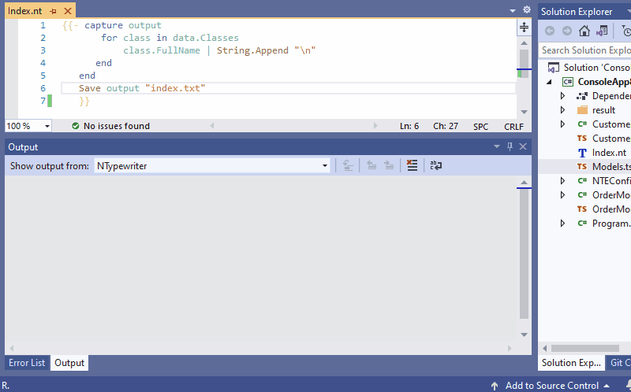

## NTypewriter editor for Visual Studio

### Getting started

1) <a name="Install"></a>Install [NTypewriter editor for Visual Studio](https://marketplace.visualstudio.com/items?itemName=NeVeS.NTypewriterEditorForVisualStudio)
2) Add template file with *.nt extension to your project
3) <a name="CodeModel"></a>You gain access to code model from your template by special global variable `data`. So let us iterate over every class defined in solution, and write its name to output.
```
{{ for class in data.Classes 
     class.FullName | String.Append "\r\n"
  end }}  
```
4) <a name="Capture"></a>Now it is time to decide what part of our template will be saved to a file. We do that by using capture statement [`capture variableName; end`](https://github.com/scriban/scriban/blob/master/doc/language.md#96-capture-variable--end). For this example we want to generate one file with list of all classes defined in solution, thus we should use capture statement outside of the for loop.
```
{{ capture output
       for class in data.Classes 
             class.FullName | String.Append "\r\n"
       end 
   end}}
```
5) <a name="Save"></a>To create file on disk we use `Save whatToSave filePath` function

```
{{ capture output
       for class in data.Classes 
           class.FullName | String.Append "\r\n"
      end
   end
   Save output "index.txt"
}}    
```
6) <a name="Run"></a>We have completed template, now we can run it and generate file.



7) <a name="Error"></a>If something goes wrong you can look at NTypewriter output. NTypewriter is very chatty about what is doing at the moment. Most of the errors also will appear on the VS Error List.

### Configuration

Options are available here:

``Visual Studio :: Main menu -> Tools -> Options -> NTypeWriter -> General``


#### Live preview

``General -> Preview -> IsEnabled``

Preview when enabled may slow down your VS significantly.

> **Note**
> Preview requires [Microsoft Edge WebView2](https://developer.microsoft.com/en-us/microsoft-edge/webview2/) to be installed on the machine.