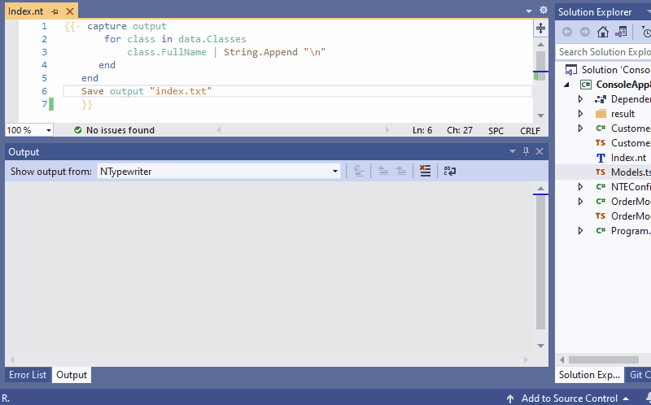

# NTypewriter

[](https://github.com/NeVeSpl/NTypewriter/actions/workflows/CI.yml)
[](https://www.nuget.org/packages?q=NTypewriter)
[](https://marketplace.visualstudio.com/items?itemName=NeVeS.NTypewriterEditorForVisualStudio)
[](https://marketplace.visualstudio.com/items?itemName=NeVeS.NTypewriterEditorForVisualStudio)

<ins>For those who do not know Typewriter</ins>:

NTypewriter is files generator from text templates populated with meta-data about your C# code. It is like a specialized and more convenient T4 design-time template.

With NTypewriter you can:
- auto-generate documentation for your C# code
- create a typed TypeScript API client for your ASP.net web API

<ins>For those who know Typewriter</ins>:

NTypewriter is a younger and more immature brother of beloved [Typewriter](https://github.com/frhagn/Typewriter). They share the same ideas, but with a completely different implementation. NTypwriter uses [Scriban](https://github.com/scriban/scriban) as a template engine, thus templates files are completely not interchangeable. While code model api is about 95% compatible between them, there are some differences. NTypewriter code model is 100% pure, without any amenities that helps generate TS files. All things that help  generate TypeScript from ASP.NET are located in built-in functions: [Action](https://github.com/NeVeSpl/NTypewriter/blob/master/Documentation/BuiltInFunctions.md#actionfunctions), [Type](https://github.com/NeVeSpl/NTypewriter/blob/master/Documentation/BuiltInFunctions.md#typefunctions).

Oh, did I forget to mention that NTypewriter also solves most of the awaited issues of the Typewriter that were promised for 2.0 version:
- support for attribute properties/values, statics, indexers, default parameters, nullable, records, constructors
- output multiple types to single file
- include types in CodeModel from referenced assemblies/nugets
- save generated file only when file content has changed
- sharable custom functions
- full control over whitespaces
- CLI is possible
- built-in support for getting all types used in class declaration ([Type.AllReferencedTypes](https://github.com/NeVeSpl/NTypewriter/blob/master/Documentation/BuiltInFunctions.md#allreferencedtypes))
- you can debug custom functions

 
### Index

* [Typewriter vs NTypewriter](#Typewriter-vs-NTypewriter)
* [Examples](#Examples)
* Getting started
   * [NTypewriter editor for Visual Studio](#Getting-started-with-NTypewriter-editor-for-Visual-Studio)
       * [Install](#Install)
       * [CodeModel](#CodeModel)
       * [Capture](#Capture)       
       * [Save](#Save)
       * [Run](#Run)
       * [When something goes wrong](#Error)
   * [Build your own CLI](Documentation/CLI.md)
* Documentation
   * [Language](https://github.com/scriban/scriban/blob/master/doc/language.md)
   * [Code model](Documentation/CodeModel.md)
   * [Built-in functions](Documentation/BuiltInFunctions.md)   
   * [Name vs BareName vs FullName](Documentation/NameVariants.md)
   * Custom Functions
       * [Nugets](Documentation/CustomFunctions.md#Nugets)
       * [Custom functions](Documentation/CustomFunctions.md#Custom-functions)  
       * [How to debug](Documentation/CustomFunctions.md#How-to-debug)
   * Editor Configuration
       * [Nugets](Documentation/Configuration.md#Nugets)
       * [Local vs Global configuration](Documentation/Configuration.md#local-vs-global-configuration)       
       * Options    
           * [AddGeneratedFilesToVSProject](Documentation/Configuration.md#AddGeneratedFilesToVSProject)
           * [NamespacesToBeSearched](Documentation/Configuration.md#NamespacesToBeSearched)
           * [ProjectsToBeSearched](Documentation/Configuration.md#ProjectsToBeSearched)  
           * [SearchInReferencedProjectsAndAssemblies](Documentation/Configuration.md#SearchInReferencedProjectsAndAssemblies)   
           * [RenderWhenTemplateIsSaved](Documentation/Configuration.md#renderwhentemplateissaved)
           * [RenderWhenProjectBuildIsDone](Documentation/Configuration.md#RenderWhenProjectBuildIsDone)
* [Known issues](#Known-issues)
* [Status of typewriter issues](Documentation/TypewriterIssues.md)


### Typewriter vs NTypewriter

&nbsp;| Typewriter | NTypewriter
----------|------------ | -------------
Template file extension | *.tst | *.nt
Syntax   | typewriter syntax | [scriban scripting language](https://github.com/scriban/scriban/blob/master/doc/language.md)
Lambda filters | present | not available 
can be used from CLI | no | yes 
Full control over whitespaces | nope | [yup](https://github.com/scriban/scriban/blob/master/doc/language.md#14-whitespace-control)
Mapping | one input always produces one output file | you can generate as many files as you want
|||
**Code model** | 
Unit of work | file | there is no concept of a file in NTypewriter, you work on compiled symbols
Access modifiers | code model contains only public types | code model contains all types 
Partial classes | treated as separate units | all parts of the class are treated as a whole unit
|||
**Automation** | 
Auto-render template on save| yes (opt-out is possible)| [yes (opt-in is possible)](Documentation/Configuration.md#renderwhentemplateissaved)
Auto-render when C# file changes| yes (opt-out is possible)| no
Auto-render on build | no | [yes (opt-in is possible)](Documentation/Configuration.md#RenderWhenProjectBuildIsDone)
|||
**Custom functions** | 
Placement|inside template file (.tst)| in seperate file (*.nt.cs)|
Can be shared|separate for every template| shared between templates inside a project |
Can be debug|no| [yes](Documentation/CustomFunctions.md#How-to-debug) |
Can be unit tested | no | yes
|||
**VS Integration** |
Supported versions of Visual Studio | 2015, 2017, 2019 | 2019, 2022
Add generated files to VS project | yes (opt-out is possible) | [yes (opt-out is possible)](Documentation/Configuration.md#addgeneratedfilestovsproject)
Sync deleted or renamed C# types with generated files | there is a part of the code that should do that  but it does not work anymore | yes 


Typewriter template:
```
module App { $Classes(*Model)[
    export class $Name { $Properties[
        public $name: $Type;]
    }]
}
```
equivalent NTypewriter template will be :
```
{{- for class in data.Classes | Symbols.WhereNameEndsWith "Model"
        capture output -}}
module App {
    export class {{ class.Name }} {
            {{- for property in class.Properties | Symbols.ThatArePublic }}
        public {{ property.Name | String.ToCamelCase }}: {{ property.Type | Type.ToTypeScriptType }};
            {{- end }}
    }
}
    {{- end 
        filePath =  class.BareName | String.Append ".ts"
        Save output filePath
    end }}
```

yes, it is more verbose, but maintaining it over time will be much easier. Both templates generate exactly the same output:
```ts
module App {
    export class CustomerModel {
        public id: number;
        public name: string;
        public orders: OrderModel[];
    }
}
```

### Examples

All examples available on [Typewriter page](https://frhagn.github.io/Typewriter/pages/examples.html) are also available in NTypewriter version:

example | NTypewriter | Typewriter
--------|------------|------------
CreateYourFirstTemplate | [CreateYourFirstTemplate.nt](https://github.com/NeVeSpl/NTypewriter.Examples/blob/master/WebApplication/Examples/CreateYourFirstTemplate/nt/CreateYourFirstTemplate.nt) | [CreateYourFirstTemplate.tst](https://github.com/NeVeSpl/NTypewriter.Examples/blob/master/WebApplication/Examples/CreateYourFirstTemplate/tst/CreateYourFirstTemplate.tst)
Extensions | [Extensions.nt](https://github.com/NeVeSpl/NTypewriter.Examples/blob/master/WebApplication/Examples/Extensions/nt/Extensions.nt) | [Extensions.tst](https://github.com/NeVeSpl/NTypewriter.Examples/blob/master/WebApplication/Examples/Extensions/tst/Extensions.tst)
ModelInterfaces | [ModelInterfaces.nt](https://github.com/NeVeSpl/NTypewriter.Examples/blob/master/WebApplication/Examples/ModelInterfaces/nt/ModelInterfaces.nt) | [ModelInterfaces.tst](https://github.com/NeVeSpl/NTypewriter.Examples/blob/master/WebApplication/Examples/ModelInterfaces/tst/ModelInterfaces.tst)
KnockoutModels | [KnockoutModels.nt](https://github.com/NeVeSpl/NTypewriter.Examples/blob/master/WebApplication/Examples/KnockoutModels/nt/KnockoutModels.nt) | [KnockoutModels.tst](https://github.com/NeVeSpl/NTypewriter.Examples/blob/master/WebApplication/Examples/KnockoutModels/tst/KnockoutModels.tst)
AngularWebAPIService | [AngularWebAPIService.nt](https://github.com/NeVeSpl/NTypewriter.Examples/blob/master/WebApplication/Examples/AngularWebAPIService/nt/AngularWebAPIService.nt) | [AngularWebAPIService.tst](https://github.com/NeVeSpl/NTypewriter.Examples/blob/master/WebApplication/Examples/AngularWebAPIService/tst/AngularWebAPIService.tst)


### Getting started with NTypewriter editor for Visual Studio

1) <a name="Install"></a>Install [NTypewriter editor for Visual Studio](https://marketplace.visualstudio.com/items?itemName=NeVeS.NTypewriterEditorForVisualStudio)
2) Add template file with *.nt extension to your project
3) <a name="CodeModel"></a>You gain access to code model from your template by special global variable `data`. So let us iterate over every class defined in solution, and write its name to output.
```
{{ for class in data.Classes 
     class.FullName | String.Append "\r\n"
  end }}  
```
4) <a name="Capture"></a>Now it is time to decide what part of our template will be saved to a file. We do that by using capture statement [`capture variableName; end`](https://github.com/scriban/scriban/blob/master/doc/language.md#96-capture-variable--end). For this example we want to generate one file with list of all classes defined in solution, thus we should use capture statement outside of the for loop.
```
{{ capture output
       for class in data.Classes 
             class.FullName | String.Append "\r\n"
       end 
   end}}
```
5) <a name="Save"></a>To create file on disk we use `Save whatToSave filePath` function

```
{{ capture output
       for class in data.Classes 
           class.FullName | String.Append "\r\n"
      end
   end
   Save output "index.txt"
}}    
```
6) <a name="Run"></a>We have completed template, now we can run it and generate file.



7) <a name="Error"></a>If something goes wrong you can look at NTypewriter output. NTypewriter is very chatty about what is doing at the moment. Most of the errors also will appear on the VS Error List.


### Known issues

NTypewriter does not have own a lexer/parser as Typewriter has, and uses Scriban instead to do heavy work. Scriban works very well with fully correct templates,  but with incomplete templates during edition not so much. It is the source of the most glitches in the Editor. Scriban language is also typeless, thus doing code completion is challenging.