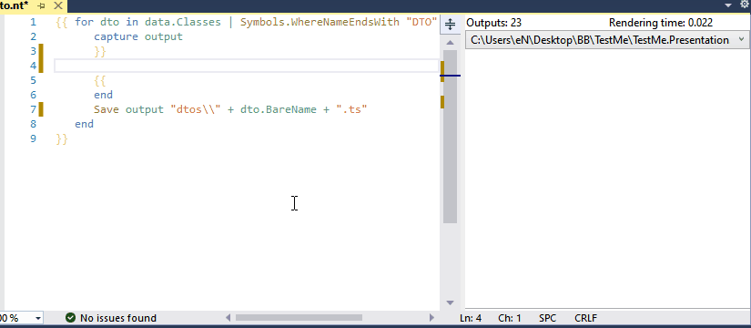

# NTypewriter

[](https://github.com/NeVeSpl/NTypewriter/actions/workflows/CI.yml)
[](https://marketplace.visualstudio.com/items?itemName=NeVeS.NTypewriterEditorForVisualStudio)
[](https://www.nuget.org/packages/NTypewriter.SourceGenerator)
[](https://www.nuget.org/packages?q=NTypewriter)



<h3 align="center">
Scriban templates + Roslyn C# code model => generated files
</h3>
<h4 align="center">
design/compile/run time == any time
</h4>

<ins>For those who do not know Typewriter</ins>:

NTypewriter is files generator from text templates populated with meta-data about your C# code. It is like a specialized and more convenient T4 design-time template.

With NTypewriter you can:
- auto-generate documentation for your C# code
- create a typed TypeScript API client for your ASP.net web API

NTypewriter comes in many flavours, that can be used according to your needs:
- [NTypewriter editor for Visual Studio](Documentation/EditorForVisualStudio.md#NTypewriter-editor-for-Visual-Studio) - extension for Visual Studio that adds support for editing *.nt templates, with syntax highlighting, code completion, live preview, design time rendering, [available on vs marketplace](https://marketplace.visualstudio.com/items?itemName=NeVeS.NTypewriterEditorForVisualStudio)   
- [NTypewriter.SourceGenerator](Documentation/SourceGenerator.md#NTypewriterSourceGenerator) - nuget, Roslyn source generator that renders *.nt templates during compilation, since it is a compiler extension, it can be used with any IDE or CI/pipeline that supports source generators
- [NTypewriter.Online](https://nevespl.github.io/NTypewriter/) - blazor client side, online demo of NTypewriter capabilities
- NTypewriter - nuget, library that enables you to create run time solution which will be able to render *.nt templates, for example: [your own CLI](Documentation/NTypewriter.md#Build-your-own-CLI)
- NTypewriter.CodeModel.Roslyn - nuget, library that exposes C# code model from an instance of `Microsoft.CodeAnalysis.Compilation`, useful if you would like to use a different template engine  

more about NTypewriter architecture and all extension points that can be used, you will find [here](Documentation/Architecture.md#NTypewriter-architecture)


<ins>For those who know Typewriter</ins>:

NTypewriter is a younger and more immature brother of beloved [Typewriter](https://github.com/frhagn/Typewriter). They share the same ideas but with a completely different implementation. NTypwriter uses [Scriban](https://github.com/scriban/scriban) as a template engine, thus template files are completely not interchangeable. While code model API is about 95% compatible between them, there are some differences. NTypewriter code model is 100% pure, without any amenities that help generate TS files. All things that help  generate TypeScript from ASP.NET are located in built-in functions: [Action](Documentation/BuiltInFunctions.md#actionfunctions), [Type](Documentation/BuiltInFunctions.md#typefunctions).

Oh, did I forget to mention that NTypewriter also solves most of the awaited issues of the Typewriter that were promised for 2.0 version:
- support for attribute properties/values, statics, indexers, default parameters, nullable, records, constructors
- output multiple types to a single file
- include types in CodeModel from referenced assemblies/nugets
- save generated file only when file content has changed
- sharable custom functions between templates
- full control over whitespaces
- compile-time rendering, without any IDE needed
- built-in support for getting all types used in type declaration ([Type.AllReferencedTypes](Documentation/BuiltInFunctions.md#allreferencedtypes))
- you can debug custom functions

 
### Index

* [Typewriter vs NTypewriter](#Typewriter-vs-NTypewriter)
* [Examples: *.nt templates](#Examples)
* Getting started
   * [NTypewriter editor for Visual Studio](Documentation/EditorForVisualStudio.md#Getting-started)
       * [Install](Documentation/EditorForVisualStudio.md#Install)
       * [CodeModel](Documentation/EditorForVisualStudio.md#CodeModel)
       * [Capture](Documentation/EditorForVisualStudio.md#Capture)       
       * [Save](Documentation/EditorForVisualStudio.md#Save)
       * [Run](Documentation/EditorForVisualStudio.md#Run)
       * [When something goes wrong](Documentation/EditorForVisualStudio.md#Error)
   * [NTypewriter.SourceGenerator](Documentation/SourceGenerator.md)
   * [Build your own CLI](Documentation/NTypewriter.md#Build-your-own-CLI)
* Documentation
   * [Template language](https://github.com/scriban/scriban/blob/master/doc/language.md)
   * [Code model](Documentation/CodeModel.md)
   * [Built-in functions](Documentation/BuiltInFunctions.md)   
   * [Name vs BareName vs FullName](Documentation/NameVariants.md)
   * Custom Functions
       * [Nugets](Documentation/CustomFunctions.md#Nugets)
       * [Custom functions](Documentation/CustomFunctions.md#Custom-functions)  
       * [How to debug](Documentation/CustomFunctions.md#How-to-debug)
   * Configuration
       * [Nugets](Documentation/Configuration.md#Nugets)
       * [Local vs Global configuration](Documentation/Configuration.md#local-vs-global-configuration)       
       * Options    
           * [AddGeneratedFilesToVSProject](Documentation/Configuration.md#AddGeneratedFilesToVSProject)
           * [NamespacesToBeSearched](Documentation/Configuration.md#NamespacesToBeSearched)
           * [ProjectsToBeSearched](Documentation/Configuration.md#ProjectsToBeSearched)  
           * [SearchInReferencedProjectsAndAssemblies](Documentation/Configuration.md#SearchInReferencedProjectsAndAssemblies)   
           * [RenderWhenTemplateIsSaved](Documentation/Configuration.md#renderwhentemplateissaved)
           * [RenderWhenProjectBuildIsDone](Documentation/Configuration.md#RenderWhenProjectBuildIsDone)
   * [Visual Studio Configuration](Documentation/EditorForVisualStudio.md#Configuration)
       * [Live preview](Documentation/EditorForVisualStudio.md#Live-preview)
        
* [Known issues](#Known-issues)


## Typewriter vs NTypewriter

&nbsp;| Typewriter | NTypewriter
----------|------------ | -------------
Template file extension | *.tst | *.nt
Syntax   | typewriter syntax | [scriban scripting language](https://github.com/scriban/scriban/blob/master/doc/language.md)
Lambda filters | present | yes
Can be used from CLI | no | yes 
Can be used in pipeline  | no | yes 
Full control over whitespaces | nope | [yup](https://github.com/scriban/scriban/blob/master/doc/language.md#14-whitespace-control)
Mapping | one input always produces one output file | you can generate as many files as you want
Live preview | no | yes
**Code model** | 
Unit of work | file | there is no concept of a file in NTypewriter, you work on compiled symbols
Access modifiers | code model contains only public types | code model contains all types 
Partial classes | treated as separate units | all parts of the class are treated as a whole unit
**Automation** | 
Auto-render template on save| yes (opt-out is possible)| [yes (opt-in is possible)](Documentation/Configuration.md#renderwhentemplateissaved)
Auto-render when C# file changes| yes (opt-out is possible)| no
Auto-render on build | no | [yes (opt-in is possible)](Documentation/Configuration.md#RenderWhenProjectBuildIsDone)
**Custom functions** | 
Placement|inside template file (.tst)| in separate file (*.nt.cs)|
Can be shared|separate for every template| shared between templates inside a project |
Can be debug|no| [yes](Documentation/CustomFunctions.md#How-to-debug) |
Can be unit tested | no | yes
**VS Integration** |
Supported versions of Visual Studio | 2015, 2017, 2019 | 2019 ([min ver 16.11.x](https://github.com/NeVeSpl/NTypewriter/issues/55)), 2022
Add generated files to VS project | yes (opt-out is possible) | [yes (opt-out is possible)](Documentation/Configuration.md#addgeneratedfilestovsproject)
Sync deleted or renamed C# types with generated files | there is a part of the code that should do that  but it does not work anymore | yes (only when the above option is enabled)


Typewriter template:
```
module App { $Classes(*Model)[
    export class $Name { $Properties[
        public $name: $Type;]
    }]
}
```
equivalent NTypewriter template will be: ([open in NTypewriter.Online](https://nevespl.github.io/NTypewriter?exampleId=type01))
```
{{- for class in data.Classes | Symbols.WhereNameEndsWith "Model"
        capture output -}}
module App {
    export class {{ class.Name }} {
            {{- for property in class.Properties | Symbols.ThatArePublic }}
        public {{ property.Name | String.ToCamelCase }}: {{ property.Type | Type.ToTypeScriptType }};
            {{- end }}
    }
}
    {{- end 
        filePath =  class.BareName | String.Append ".ts"
        Save output filePath
    end }}
```
 
yes, it is more verbose, but maintaining it over time will be much easier. Both templates generate exactly the same output:
```ts
module App {
    export class CustomerModel {
        public id: number;
        public name: string;
        public orders: OrderModel[];
    }
}
```

## Examples

All [Typewriter examples](https://frhagn.github.io/Typewriter/pages/examples.html) are  available as .nt templates on github and also on NTypewriter.Online website. 
> **Note**
 > nt. templates produce exactly the same output as .tst templates, even bad output formatting was preserved, to make them easier to compare. 

example | NTypewriter | Typewriter | Online
--------|------------|------------|------------
CreateYourFirstTemplate | [CreateYourFirstTemplate.nt](https://github.com/NeVeSpl/NTypewriter.Examples/blob/master/WebApplication/Examples/CreateYourFirstTemplate/nt/CreateYourFirstTemplate.nt) | [CreateYourFirstTemplate.tst](https://github.com/NeVeSpl/NTypewriter.Examples/blob/master/WebApplication/Examples/CreateYourFirstTemplate/tst/CreateYourFirstTemplate.tst) | [open](https://nevespl.github.io/NTypewriter?exampleId=type01)
Extensions | [Extensions.nt](https://github.com/NeVeSpl/NTypewriter.Examples/blob/master/WebApplication/Examples/Extensions/nt/Extensions.nt) | [Extensions.tst](https://github.com/NeVeSpl/NTypewriter.Examples/blob/master/WebApplication/Examples/Extensions/tst/Extensions.tst) | [open](https://nevespl.github.io/NTypewriter?exampleId=type05)
ModelInterfaces | [ModelInterfaces.nt](https://github.com/NeVeSpl/NTypewriter.Examples/blob/master/WebApplication/Examples/ModelInterfaces/nt/ModelInterfaces.nt) | [ModelInterfaces.tst](https://github.com/NeVeSpl/NTypewriter.Examples/blob/master/WebApplication/Examples/ModelInterfaces/tst/ModelInterfaces.tst) | [open](https://nevespl.github.io/NTypewriter?exampleId=type02)
KnockoutModels | [KnockoutModels.nt](https://github.com/NeVeSpl/NTypewriter.Examples/blob/master/WebApplication/Examples/KnockoutModels/nt/KnockoutModels.nt) | [KnockoutModels.tst](https://github.com/NeVeSpl/NTypewriter.Examples/blob/master/WebApplication/Examples/KnockoutModels/tst/KnockoutModels.tst) | [open](https://nevespl.github.io/NTypewriter?exampleId=type03)
AngularWebAPIService | [AngularWebAPIService.nt](https://github.com/NeVeSpl/NTypewriter.Examples/blob/master/WebApplication/Examples/AngularWebAPIService/nt/AngularWebAPIService.nt) | [AngularWebAPIService.tst](https://github.com/NeVeSpl/NTypewriter.Examples/blob/master/WebApplication/Examples/AngularWebAPIService/tst/AngularWebAPIService.tst) | [open](https://nevespl.github.io/NTypewriter?exampleId=type04)

## Known issues

NTypewriter does not have own a lexer/parser as Typewriter has, and uses Scriban instead to do heavy work. Scriban works very well with fully correct templates,  but with incomplete templates during editing not so much. It is the source of the most glitches in the Editor. Scriban language is also typeless, thus doing code completion is challenging.
